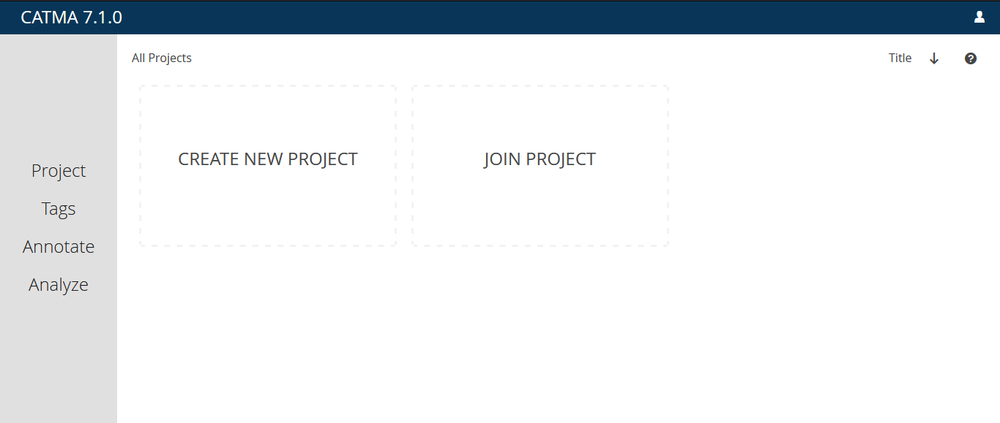
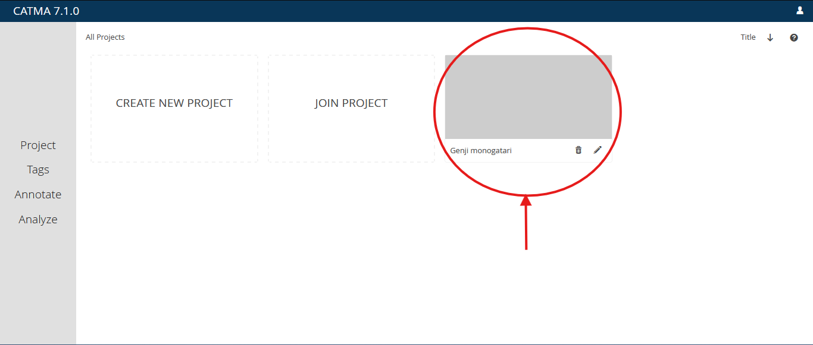
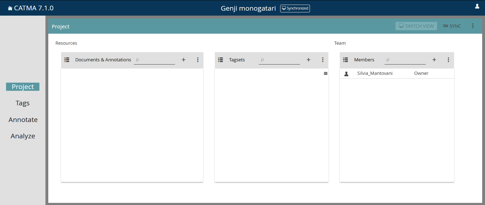
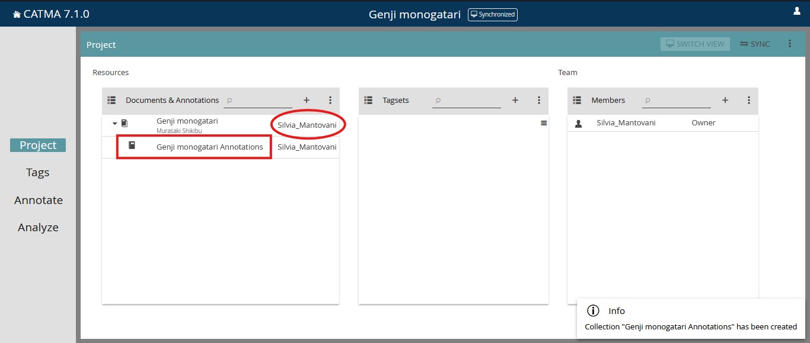

## A brief Introduction: What is CATMA?

[CATMA](https://catma.de/), or  **Computer Assisted Text Markup and Analysis**, is a free open source tool for text annotation, analysis and visualization that supports collaborative work. 

It is made up of four modules, which are briefly outlined as follows but will be discussed in greater detail later:

| Module | Description|
|--------|------------|
|PROJECT | The place where you manage your project resources|
| TAGS   | It enables you to add, edit and delete tagsets|
| ANNOTATE | It allows you to annotate your text, edit and delete annotations |
| ANALYZE | It offers you the opportunity to analyze your text, but also to do visualization and semi-automatic annotation|

 
_CATMA's homepage (on the left, marked in red are the four modules)_

Text and annotation can be searched and analyzed using the **built in query language** based on different criteria, such as word frequency, annotation category or similarity to other words and annotations (?). 
The results of query can be visualized and explored using the distribution graph or the word cloud, for example. 

>
>### Table of contents
>
>-  [Project preparation and Annotation](#project-preparation-and-annotation)
>    - [Account and Login](#account-and-login)
>    - [Project Overview](#project-overview)
>    - [Project Module](#project-module)
>-  [Analysis, Visualizations and semi-automatic Annotation](#analysis-visualizations-and-semi-automatic-annotation)
> 

### Project preparation and Annotation

#### Account and Login
  
First of all, in order to use CATMA you need to create an account.

_If you want to sign up and start your session on CATMA_: https://app.catma.de/

As for the account, you can either use a Google account or a private e-mail. 
After signing up, you will receive a verification e-mail to the address you used for registration. 
Once your e-mail adress has been verified, you will be able to complete your profile by choosing username and password. 
Sign in to access the project overview, and you will be all set to begin your first project.

#### Project Overview

You will see that you have the option to either create or join a project. Moreover there is a sidebar on the left with all the modules introduced earlier, which will be deactivated. In fact, if you click on the sidebar it won't work. But don't worry, it will be activated as soon as you enter your project. 
The sidebar will guide you through the different modules.  

#### Project module

As soon as you enter the project module by selecting the project you want to work on, you will see all the components of your project:

_Here I have created a new project and given it a name._

_These are the components of the project._

 
The project module allows you to manage those components, each displayed in a tile. As you can see there are three tiles, one for documents and annotations, one for the tagsets and one for the project members. 

_DOCUMENTS & ANNOTATIONS_  
In the the first tile, if you click on the "+ symbol" you can upload documents from your local computer or you can simply add an URL. Furthermore, among other options you can delete and export documents and collections including your annotations.  

In order to annotate the documents, you always have to create an **annotation collection** first. Annotation collections are basically copies of the text to be annotated.  
Please bear in mind that <ins>in CATMA annotations are stored separately from source documents</ins>.   

You will also see which person has created a resource and who is therefore responsible for it. 
Please note that you can only add an annotation collection if your project role allows it.  
On CATMA, there are three different **roles** tied to different permissions: 

1.  OWNERS create the project and have all the rights.  
2.  PARTNERS can do everything except manage members or delete a project.  
3.  ASSISTANTS don't have any project administration rights and cannot create or delete resources, but can view tags and annotations.    

In the screenshot above, the role is shown in the third tile, labeled "Members". In this case, since I created this project and am the only one working on it, the role assigned to me is, of course, "Owner".

_TAGSETS_  
In the second tile you can see which tagsets have been created for this project, you can also create a new tagset, delete tagsets or edit them.  
Notice though that while you can create new tagsets, if you want to actually add a tag to the tagset you will have to do this in the tags module. 
Nevertheless in the project module you can also upload your existing tagsets in XML format if you wish to do so. 

_MEMBERS_  
The third tile in the project module will display at least the project owner. If your role allows it, you can add new members to this project either manually by adding his/her username or via invitation in real time. So if you choose the latter, pop up dialogue with a code will appear and everyone who has access to the code will be able to join the project. This code will be valid as long as you keep the pop up window opened, then it won't be valid anymore.  
Moreover, you can of course edit the role of members or delete members.

One very important information is the synchronized button in the upper right corner (). Whenever you work together with others in a collaborative project, each individual team member has to synchronise his/her project progress in order to share their uploaded documents, annotations or new tags with the other team members. So, clicking this button starts the process of integrating your changes with the most recent stage of the process. In other words, it attempts to integrate anything you have done since you last synchronised. This can sometimes lead to conflicts.
Where two or more project members have made conflicting changes and which sometimes have to be resolved manually.
And yeah, when using for example Git and GitLab terminology, if you're familiar to this synchronisation creates a merge request.
And our pull requests and to merge your user branch into the main or master branch and where possible leave this merge request is automatically merged if an automatic merge is not possible, the merge request remains open and then can be inspected in our Git lab back end by yourself.
Moreover, it is important to note that in collaborative projects, the switch.
Button or the Switch view button on the left of the synchronise button is enabled to allow for switching between two view modes which are synchronised. On the one hand, and latest contributions on the other hand. So synchronised shows the current state of all work that has been integrated, plus anything that you as an individual user have done. On top of that and latest contributions allows for read only access to all project members.
What an additive view that combines the current integrated project stayed with the last latest changes without the need for synchronisation or complicated integration and conflict resolution work up front.
When spinning to the latest contributions view, the project enters a read only state and allows you to see what the other Members have been up to. So you see those two buttons over there.
Then let's go to the tech, the text module or I need to text that module, but it should be the text module.
So once you have uploaded and edited your resources and you will, presumably you also want to create a text set and therefore you have to switch into this text module so the text module displays the text that's off your projects. You can see which of these text that are currently selected.

### Analysis, Visualizations and semi-automatic Annotation

