# Il corpus TIGR: raccolta, trascrizione, trattamento e gestione di dati videoregistrati per lo studio dell'italiano parlato 
## Introduzione al corpus TIGR
Il corpus d'italiano parlato TIGR è stato raccolto negli anni 2021 e 2022  nei cantoni svizzeri Ticino e Grigioni (da qui il nome) e nasce all'interno di un progetto di ricerca condotto dall'Università della Svizzera Italiana (USI), **InfinIta - La categorizzazione delle fonti di informazione nell'interazione faccia a faccia. Una indagine basata sul corpus di italiano parlato TIGR** (per l'abstract e le pubblicazioni scientifiche: https://data.snf.ch/grants/grant/192771), il quale terminerà il 31 agosto 2025. Le domande di ricerca a cui si è cercato di rispondere (le metto qui perché di fatto parla di InfinIta).  
Come si legge sul [sito dell'USI](https://sharetigr.usi.ch/it/st/sharetigr), il corpus TIGR "contiene non solo registrazioni audio, trascrizioni e dati sociolinguistici, ma anche registrazioni video".   
Per condividere il corpus con la comunità scientifica è nato **ShareTIGR**, un progetto specificamente dedicato agli _open research data_ (ORD). Al momento, però, non è ancora possibile accedere al corpus.  

## Perché è stato creato il corpus TIGR?

Il corpus TIGR è nato per cercare di rispondere a sostanzialmente tre domande che riguardano la categorizzazione delle fonti di informazione nell'italiano parlato: 
 
fin dall'inizio l'intento era quello di mettere a disposizione i dati. dovevamo preoccuparci anche dell'utilizzo più ampio di questi dati. alcune scelte sono dovute alla volontà di renderli utili anche ad altri. -> DOVE LO METTO?

1. A livello semiotico, attraverso quali risorse (indicatori e costruzioni di evidenzialità, strategie discorsive, strategie multimodali, implicature) viene comunicata la fonte dell'informazione?
   
2. A livello semantico, quali distinzioni relative alla fonte dell'informazione diventano rilevanti? Categorizzazioni specifiche, ad esempio: 'Il presidente non è in forma. _Lo ha detto il suo portavoce durante la conferenza stampa di ieri_' / '_È evidente dal modo in cui si è comportato durante il dibattito televisivo di ieri_' rispetto a categorizzazioni generiche, ad esempio: '_Ho sentito dire_ / _A quanto pare_ il presidente non è in forma'
   
3. A livello pragmatico, come la categorizzazione delle fonti di informazione contribuisce al posizionamento epistemico?  

 
Le risorse, i ruoli dei partecipanti e la sequenzialità del posizionamento epistemico variano a seconda dei tipi di interazione. TIGR consente di studiare questa variazione in quanto sono stati inclusi all'interno del corpus diversi tipi di interazione.
TIGR is a video corpus and therefore allows to examine multimodal evidential resources.
Sono stati inclusi vari tipi di situazione, volevamo avere una certa variazione tra i generi interazionali. non volevamo focalizzarci su un solo tipo di situazione ma poter documentare una certa variazione e quello che eventualmente è invariabile, quindi di poter fare delle generalizzazioni.

TIGR è un corpus video e permette quindi di esaminare le risorse evidenziali multimodali.
Il TIGR è un corpus video, particolarità di questo corpus oltre alle sue caratteristiche diatopiche, cioè che è stato raccolto in Svizzera.

Secondo paragrafo_ Perché un corpus video dell'italiano parlato?
1. l'immagine video ci consente lo studio dell'uso integrato di mezzi verbali, mezzi multimodali e risorse situazionali (oggetti a disposizione in una situazione che diventano funzionali alla comunicazione):
    - fonti in situ (acquisizione di informazioni durante l'interazione in corso grazie alla percezione diretta e alle inferenze basate su indizi percettivi)
     "Hanno suonato alla porta, sarà il postino", "Questo ragno si muove...sarà ancora vivo". questi esempi sono trattati nella letteratura sull'evidenzialità di solito sulla base di esempi costruiti. Quando però abbiamo dei dati video possiamo capire quali sono eventuali stimoli presenti che diventano funzionali all'espressione della fonte. possiamo farlo in modo empirico, non costruendo degli esempi.
    - ruolo della direzione dello sguardo e di certi gesti nel posizionamento epistemico
      L'immagine video ci consente di studiare la multimodalità in tutti i sensi, l'uso dello sguardo, l'integrazione tra sguardo e altre modalità
    - costruzione del riferimento deittico 
       qui, qua... interpretabili molto meglio quando abbiamo delle immagini

2. studio della grammatica (sintassi, segnali discorsivi) in interazione  19.04
   si cerca di capire la relazione tra grammatica e interazione nei due sensi: la grammatica come risorsa che organizza l'interazione e la grammatica che emerge da strutture sequenziali
    - visione più completa dello sviluppo sequenziale, tenendo conto della multi-attività
     multi-attività: dove il discorso si intreccia con attività parallele di diversa natura

3. studio della variazione diafasica
  - visione più adeguata della varietà generica (tipi di situazione)
    si è parlato del written bias in linguistica, ma c'è anche un audio bias
    questo significa che alcuni tipi di situazione sono ben documentabili tramite l'audio-registrazione e possono essere studiate, altri tipi di situazione non sono così interessanti da studiare se uno ha solo l'audio perché si perde troppa informazione (es lezione di guida), quindi la tendenza è di non studiarle perché ci perdiamo una parte della variazione diafasica

riteniamo quindi che possa valere la pena costruire dei corpora con dati audioregistrati, anche se richiede tanto sforzo e lavoro

terza sezione_ composizione del corpus  [Composizione del corpus](https://sharetigr.usi.ch/it/news/feeds/37812)
FORSE PER LA COMPOSIZIONE DEL CORPUS POSSO SEMPLICEMENTE LINKARE L'ARTICOLO

il design del corpus e la sua composizione risponde a queste questioni teoriche più generali di cui si è parlato e a questioni più specifiche legate al corpus
abbiamo detto che il TIGR è stato raccolto in vista di domande di ricerca specifiche relative alla fonte di informazione, e in questo senso può essere considerato uno _special corpus_

The TIGR corpus in and beyond Infinita
TIGR was collected in view of a specific research goal (special corpus).
The first goal of TIGR has been to answer research questions related to information source in interaction:
• Resources, participant roles and the sequentiality of epistemic positioning vary across interaction types. TIGR allows to study that variation.
• TIGR is a video corpus and therefore allows to examine multimodal evidential resources.
However, being varied as to interaction types and being complementary to other corpora of spoken Italian as to geographical variation and technical set-up, it has a potential to be reused in further research.
Reference corpus (balanced, representative)
vs. opportunistic corpus (consisting of several special corpora "one [sc. the corpus owner/compiler] can lay hands upon") 
TRADUZIONE
Tuttavia, essendo vario per quanto riguarda i tipi di interazione ed essendo complementare ad altri corpora di italiano parlato in termini di variazione geografica e configurazione tecnica, ha il potenziale per essere riutilizzato in ulteriori ricerche.
Corpus di riferimento (bilanciato, rappresentativo)
vs. corpus opportunistico (composto da diversi corpora speciali che 'si possono raccogliere facilmente [dal punto di vista del proprietario/compilatore del corpus]'). -> CHATGPT
è un corpus opportunistico, collezioni di corpora speciali raccolti all'interno di uno specifico progetto di ricerca.
non è un corpus di riferimento, non è nato a livello di design come un corpus bilanciato per tutta una serie di variabili sociolinguistiche ma si può espandere o inserire all'interno di una rete.

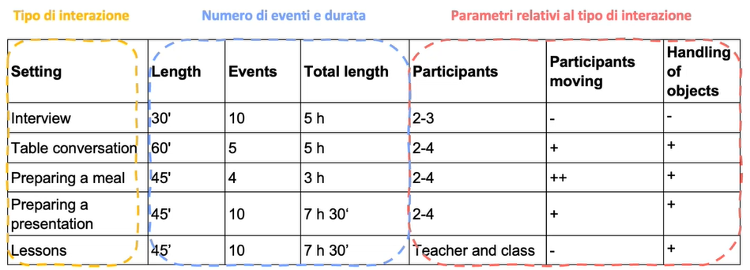
Design del corpus TIGR nel 2020

Come si è detto, sono stati inclusi diversi tipi di interazione: intervista, conversazione a tavola, preparazione di un pasto, lavori di gruppo e lezioni; per un totale di 28 ore. 
Si era pensato ai parametri che differenziano questi tipi di interazione. Parametri che hanno un impatto sul tipo di analisi che ci interessava relativo alle fonti di informazione e al posizionamento epistemico. 
parametri: numero di partecipanti, se i partecipanti si muovono o meno e se qualcuno di loro manipola degli oggetti.
C'è un dibattito su quali parametri siano effettivamente pertinenti per descrivere la variazione dei tipi di interazione. Pe noi la manipolazione di un oggetto è un parametro importante perché può determinare una variazione per quanto riguarda l'espressione dei tipi di fonte di informazione. 
Il design nasceva pensando a questo tipo di variazione diafasica. 

Ci sono stati dei cambiamenti strada facendo.
I dati sono stati raccolti circa da maggio 2021 a maggio 2022. 
Riadattamenti del design dovuti alle restrizioni Covid e alla disponibilità effettiva dei parlanti.
Il Covid ha ritardato l'inizio della raccolta dati e la possibilità di registrare le situazioni di interazione che avevamo pensato.
sono state privilegiate le interazioni in ambienti privati. 
Alla fine del processo abbiamo ottenuto 23h 30' di videoregistrazione, 23 eventi e 115 parlanti.

per quanto riguarda la composizione siamo arrivati a questa tabella:

 

I setting, ovvero i tipi di interazione: conversazioni a tavola in ambienti privati tra amici e famigliari, preparazione di pasti, interviste. Il cambiamento sta nei contesti didattici, dove sono state registrate lezioni molto atipiche di tre tipi: sessioni di tutoring in architettura, lezioni di teatro, di musica e di restauro e lezioni di glottodidattica e di cultura generale nella scuola superiore in cui gli studenti si cimentavano in lavori di gruppo e presentazioni. 
I parametri sono sempre gli stessi, tranne per il parametro dell'istituzionalità. Ci sono dei generi istituzionali, come quello dell'intervista o della didattica. E ci sono dei generi non istituzionali. Questo si lega al ruolo dei partecipanti, che può essere simmetrico o asimmetrico. Questo è un parametro molto importante per studiare la fonte di informazione, e in generale la dimensione epistemica. Se un rapporto di asimmetria gerarchica è anche un'asimmetria epistemica, o se i rapporti tra i parlanti sono variabili.
Il movimento dei partecipanti e la manipolazione degli oggetti ha a che fare con la multi-attività, cioè quando i parlanti sono impegnati oltre che nel discorso anche in un'attività non verbale. La multi-attività ha un effetto quantomeno sull'organizzazione sequenziale del discorso e poi sull'interpretazione dei fenomeni linguistici che si vogliono studiare.

Per gli esempi mi piacerebbe creare dei **collegamenti ipertestuali al video del seminario**

## Parlanti del TIGR

### Reclutamento dei parlanti

Il contatto e il reclutamento dei partecipanti sono descritti in dettaglio nel seguente articolo: [Il lavoro sul campo: ricerca e contatto dei partecipanti](https://sharetigr.usi.ch/it/news/feeds/38402). Nel testo dell'articolo è presente anche il link al questionario che è stato sottoposto ai parlanti.

Il requisito fondamentale che i parlanti dovevano possedere per essere scelti come partecipanti era di essere **italofoni**. Non era necessario che la lingua italiana fosse la lingua madre (L1).

Per un approfondimento sul questionario che i parlanti hanno dovuto compilare: [Digitisation of the TIGR participant questionnaires](https://sharetigr.usi.ch/en/news/feeds/37690)

### Dichiarazioni di consenso informato: esigenze della ricerca, esigenze legali e questioni etiche

- Modello USI e contatti con Commissione etica e Servizio legale
Abbiamo operato con un modello di consenso informato interno a USI
- Riferimenti legislativi e linee guida, come la Legge federale sulla protezione dei dati, e linee guida come quelle indicate da FORS
Per una riflessione approfondita sulle tematiche legali, si rimanda all'articolo [Social interaction is among people. Legal, technical, and ethical explorations about personal information and its removal in talk-in-interaction as data](https://www.chord-talk-in-interaction.usi.ch/news/feeds/36387)

- Prevedere fin dall'inizio la pubblicazione dei dati (video) richiede una riflessione sui contenuti delle dichiarazioni:
  due problematiche maggiori
  Come gestire la de-identificazione dei parlanti? Come descrivere in modo informativo ma non limitante il futuro riuso dei dati? Quali impegni possiamo prendere come ricercatori? Noi ricercatori abbiamo preso degli impegni con i nostri partecipanti. è un passaggio delicato, non soltanto come tutela legale ma proprio anche di rapporto di fiducia che si può instaurare con il parlante che decide sulla base del documento informativo o di aderire o meno al progetto. 
  Si parla di "de-identificazione" e non di "anonimizzazione". Per una definizione terminologica si rimanda all'articolo [Social interaction is among people. Legal, technical, and ethical explorations about personal information and its removal in talk-in-interaction as data](https://www.chord-talk-in-interaction.usi.ch/news/feeds/36387)

Qui di seguito, la struttura del documento di dichiarazione di consenso informato che è stato fatto firmare ai partecipanti.

Parte A. Documento informativo:
1. Introduzione 
2. Descrizione del progetto di ricerca per un pubblico non specialista
3. Descrizione dell'evento e modalità di video-registrazione
4. Confidenzialità e protezione dei dati
5. Conservazione e utilizzo dei dati
6. Diritti dei partecipanti allo studio
7. Contatti

Parte B. Consenso informato:
Scelta tra diverse misure di de-identificazione
   - default> pseudonimi nella trascrizione, silenzi nella traccia audio, misure di de-identificazione nei metadati
   - misure supplementari> alterazione della voce nella traccia audio (6 richieste), applicazione di filtri nella traccia video (15 richieste)

Per saperne di più a proposito della stesura del documento di dichiarazione di consenso informato da parte del team di InfinIta, si legga [Dichiarazioni di consenso informato](https://sharetigr.usi.ch/it/news/feeds/38259)

#### Misure di de-identificazione dei dati 

Per quanto riguarda le misure di de-identificazione dei dati inseriti dai partecipanti, sono stati adottati alcuni provvedimenti:
- Ad ogni partecipante è stato attrbuito un codice informatore nel formato inf-N. 
- L'età è stata ridotta a un intervallo.
- Per quanto riguarda le informazioni sul luogo di provenienza, è stato inserito lo Stato (Italia o Svizzera) e il cantone/regione.

### Dati sociolinguistici ricavati

Di seguito si riportano alcuni grafici sui principali dati sociolinguistici che riguardano il campione di parlanti considerato.

- #### Genere e età
  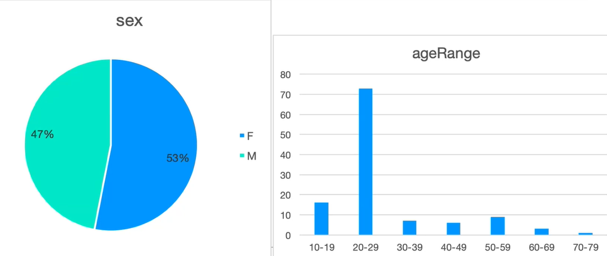

  _Come si può vedere dal grafico a sinistra,  il corpus è abbastanza bilanciato con una presenza femminile (53%) di poco superiore a quella maschile (47%)._  
  _Nel grafico a destra vengono mostrate le fascie d'età, con una sovrarappresentazione della fascia degli studenti universitari (20-29)._  

- #### Origine dei parlanti
  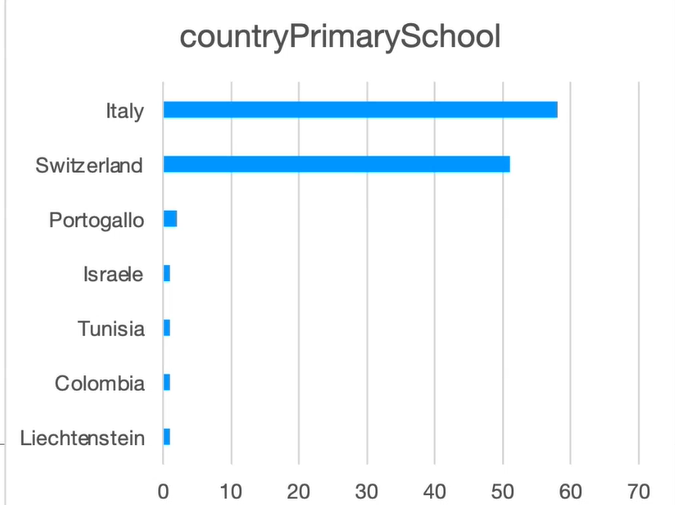

  _La maggior parte dei partecipanti ha frequentato la scuola elementare in Italia e in Svizzera._

  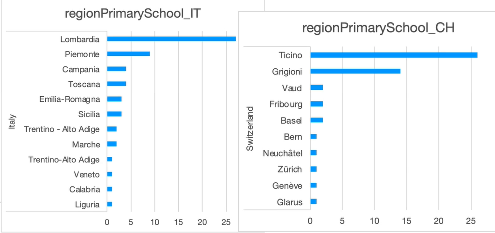
  _Qui vengono mostrati i dati specifici sulle regioni italiane e sui cantoni svizzeri in cui i parlanti hanno frequentato la scuola elementare. Nonostante un certo bias geografico per quanto riguarda l'Italia, con Lombardia e Piemonte in testa, diverse regioni sono rappresentate, sia del centro sia del sud._
  _In merito alla Svizzera, la maggior parte dei parlanti ha frequentato la scuola elementare nei cantoni Ticino e Grigioni._

- #### Luogo di lavoro o studio in Svizzera
  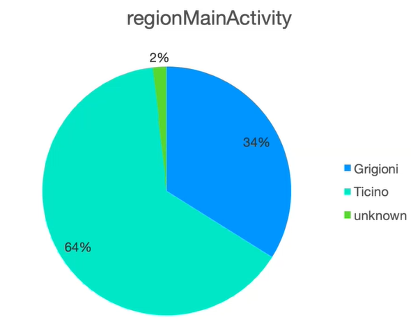
  _La maggior parte dei parlanti svolge la sua attività principale (studio o lavoro) in Ticino (64%). Al secondo posto troviamo i Grigioni (34%)._

- #### Repertorio linguistico
  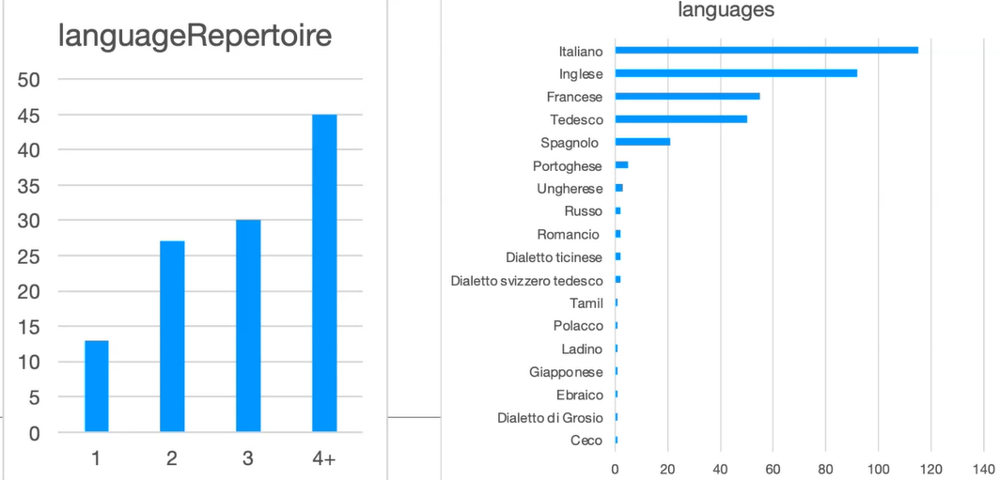
  _La maggior parte dei parlanti ha dichiarato di essere plurilingue (due, tre o addirittura più di quattro lingue nel repertorio). La lista delle lingue conosciute dai partecipanti sono riportate nel grafico di destra._

- #### Istruzione e professione
  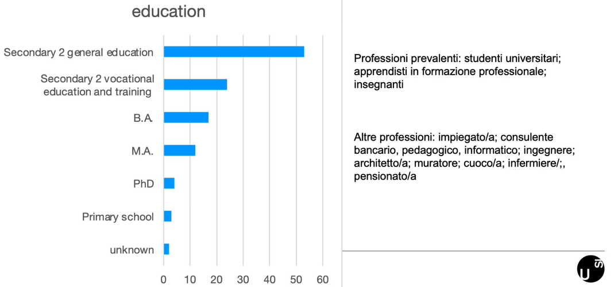
  _Il livello di istruzione principale è la scuola secondaria di secondo grado. Trattandosi per la maggio parte di studenti universitari, era l'ultimo grado di istruzione completato._

## Luoghi dove sono stati registrati gli eventi del TIGR
Come è stato detto, la registrazione delle interazioni è avvenuta nei cantoni Ticino e Grigioni. Le località all'interno dei due cantoni sono determinate in modo opportunistico in base alla disponibilità dei parlanti. In una seconda fase della raccolta, la presa di contatto ad hoc con le istituzioni scolastiche ha permesso di ampliare la copertura geografica del corpus.

In Ticino sono stati registrati 9 eventi in 7 piccoli centri e altri 9 eventi in 2 grandi centri, per un totale di 18 eventi in 9 località.
Nei Grigioni sono stati registrati 4 eventi in 1 piccolo centro e altri 4 eventi in 1 grande centro, per un totale di 5 eventi in 2 località.

Si precisa che il corpus non è disegnato per documentare la variazione diatopica dell'italiano parlato in Svizzera.

#### Misure di de-identificazione del luogo di registrazione:
- il luogo di registrazione viene descritto solamente dal Cantone e dalle dimensioni del centro (> o <10,000 abitanti). 

## Impostazione tecnica delle registrazioni, post-produzione e trascrizione

### Strumentazione utilizzata e post-produzione
L'impostazione di base è stata quella di andare sul luogo della registrazione, installare i dispositivi e lasciare che i parlanti interagissero da soli. Solamente nelle interazioni didattiche e nelle interviste erano presenti anche i ricercatori.
Una volta conclusesi le interazioni, i ricercatori venivano contattati dai partecipanti tramite Whatsapp.

Per informarsi sulla strumentazione utilizzata per le registrazioni e sulla post-produzione si veda **collegamento ipertestuale con il sito del corpus "Registrazioni audio e video"** e l'articolo [Dall'evento al dataset](https://sharetigr.usi.ch/it/news/feeds/37851).

### La trascrizione

Per la trascrizione è stato utilizzato il software ELAN, v. 6.7. 
La trascrizione finora è stata svolta da tre studentesse assistenti impiegate in periodi diversi. Attualmente il team di InfinIta collabora con una studentessa e uno studente assistenti per completare la trascrizione.
Il team del progetto lavora sulla revisione delle trascrizioni, sull'esportazione e la formattazione.

Per la trascrizione è stato adottato il sistema GAT2 (Gesprächsanalytische Transkriptionssystem):
- funzionale a una trascrizione tramite software e machine-readable
- integrato in editor digitali (per esempio EXMARaLDA)
- tre livelli di granularità: minimal script, basic script e fine script (quello più dettagliato e usato per il corpus TIGR)

Alla guida interna sono stati aggiunti:
- una lista di lemmi per uniformare la grafia delle interiezioni
- la trascrizione del raddoppiamento fonosintattico (ex., _va bbene_, _e nniente_ )
- l'uso del simbolo ~ per le interruzioni udibili di una parola (in particolare, glottal stop), per esempio in esitazioni o ripartenze  
  
Di seguito sono riportate alcune delle convenzioni GAT2 utilizzate nella trascrizione delle registrazioni

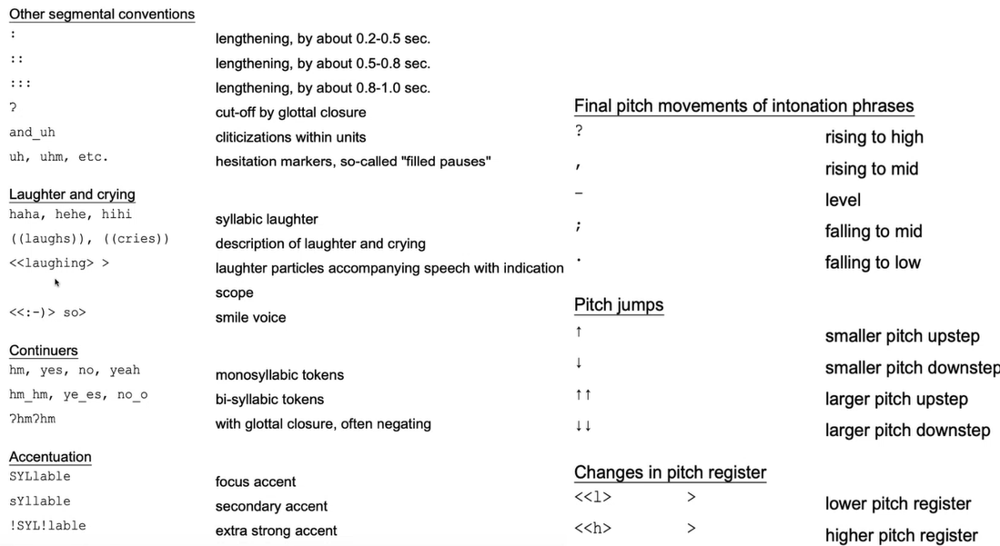

Da notare l'annotazione del comportamento non verbale (guarda nell'immagine sopra in  "Laughter and crying") che funziona con la logica del tag.

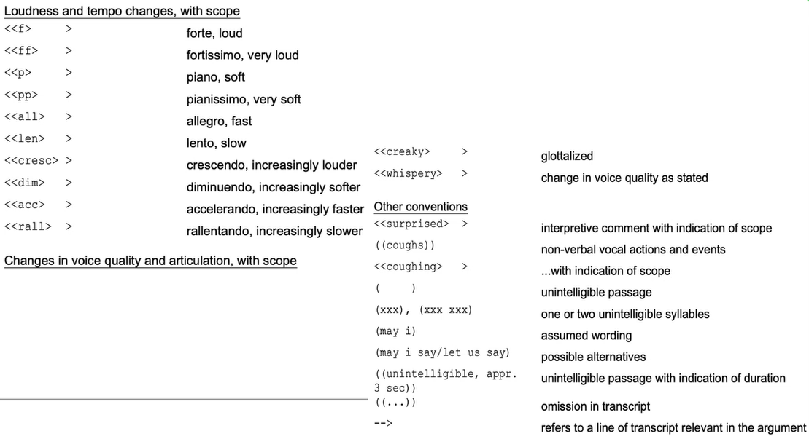

Inoltre, sono state adottate convenzioni di trascrizione multimodale di Modada per il tier "ambient noises", come nel seguente esempio:

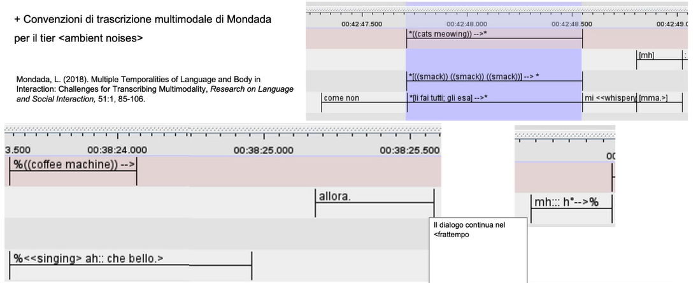

#### Misure di de-identificazione di persone e luoghi nella trascrizione

Sono stati attribuiti **pseudonimi** solo ai partecipanti all'interazione in corso, come si vede nell'esempio di seguito:

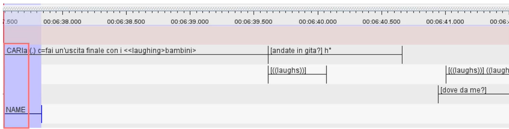

Per i nomi delle altre persone è stato adottato il formato PERSONNAME, numerato progressivamente: 

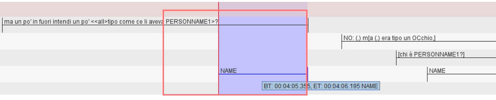

Stessa cosa è stata fatta per i nomi di luoghi, adottando il formato PLACENAME:

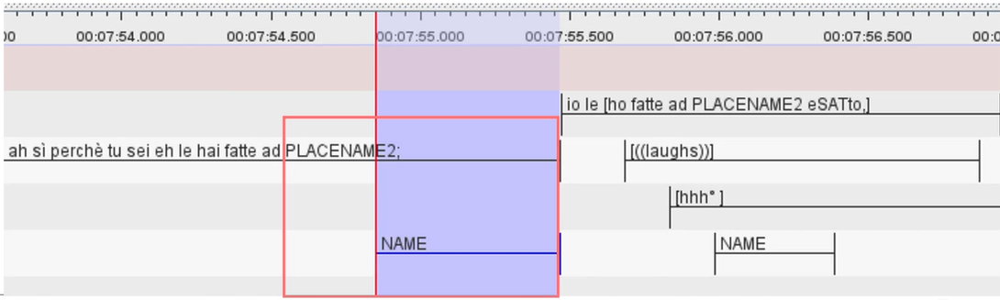

Idem per le istituzioni, per le quali si è adottato il formato INSTITUTIONNAME

#### La segmentazione in Elan

La segmentazione non rappresenta necessariamente un'unità significativa sul piano linguistico. 
La segmentazione è stata pensata per essere funzionale ad una trascrizione accurata, come nel caso di sovrapposizioni multiple. 
Vedi esempio video al minuto 1:07:06 fino a 1:09:56.

Il problema di come trascrivere le sovrapposizioni si pone in particolare nel caso degli schismi. Non si tratta solamente di conversazioni parallele, ma a volte c'è anche uno spostamento associato. Facciamo l'esempio delle conversazioni a tavola: quando due persone si alzano e vanno in cucina e altre due rimangono a tavola si hanno due conversazioni parallele. La stessa cosa accade durante le lezioni di restauro quando due gruppi lavorano in due parti diverse della chiesa.

Esempio a 1:10:42 fino a 01:11:48 -> crea collegamento ipertestuale 

#### La derivazione di trascrizioni in formato testo in stile "dialogo teatrale" 

Come esportare la trascrizione da ELAN e creare un formato leggibile?  
Come abbiamo visto, la prima trascrizione avviene su ELAN. Da questa trascrizione possono derivate altri due tipi di trascrizione:
- una trascrizione in stile "dialogo teatrale" e formato TXT, come questa:
  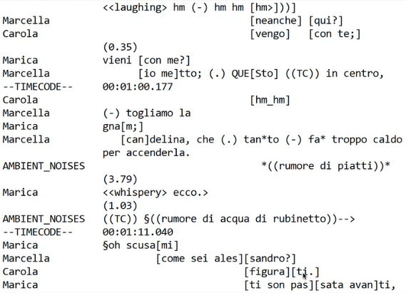
  
  
  Questo tipo di trascrizione offre un'approssimazione grafica dell'organizzazione della conversazione in turni e una buona base per un'analisi sequenziale.   
  Inoltre, costituisce un input per l'annotazione delle fonti di informazione all'interno del progetto InfinIta, eseguita nel programma INCEpTION.  
  Infine, il formato TXT è semplice e interoperabile.

  Come fare per passare da una trascrizione ELAN a una trascrizione di questo tipo?
  Si può esportare da ELAN la trascrizione in formato testo "tradizionale", con o senza timecode e con la formattazione automatica dei turni. 
  Però sono stati riscontrati alcuni problemi, tra cui:
  - se si intende esportare la trascrizione con il timecode, il file risulta illeggibile
  - la messa in sequenza automatica dei turni non è sempre intuitiva  
  
  La soluzione è stata quella di condurre una **procedura semi-automatica (script Python)** 
  - la trascrizione veniva esportata da ELAN come trascrizione in formato "tradizionale" e con l'allineamento verticale delle parentesi quadre
  - Attraverso degli script sono stati eliminati i timecode tranne quelli che segnano i tempi iniziali dei segmenti (creati su ELAN), che compaiono all'incirca ogni 10 secondi. Sono, poi, state collocate delle ancore "((TC))" nel testo, come si vede in questo esempio 
  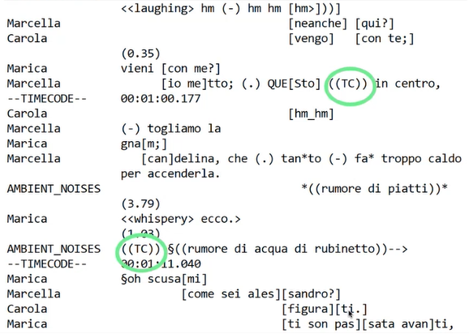
  - Sono stati eliminati i nomi di parlanti superflui e sono stati concatenati i segmenti
  - Si è formattato manualmente le trascrizioni quando presentavano sovrapposizioni di più di due parlanti
  
- Una trascrizione in versione tokenizzata, di cui si parlerà nel paragrafo successivo. 
  
#### Verso una versione tokenizzata delle trascrizioni

I due tipi di trascrizione, quella originale in ELAN e quella in stile "dialogo teatrale" in formato TXT, non sono tokenizzate.   
Cos'è la tokenizzazione? È la divisione di un testo in "token", cioè unità linguisticamente pertinenti di varia complessità. È indispensabile per l'inserimento in un database e ai fini della ricerca lessicometrica, morfo-sintattica, fonologica, ecc. Fornisce, infine, gli input per le procedure di annotazione automatica (per esempio, l'annotazione delle parti del discorso e la lemmatizzazione)

Per questa procedura di tokenizzazione delle trascrizioni si sta collaborando con l'azienda _Linguisticbits_ del Dr. Thomas Schmidt.
La procedura comprende i seguenti step, elencati in ordine di precedenza:
1. Ricongiungimento dei frammenti di parola creati ai confini dei segmenti in ELAN, che avverrà in maniera in parte automatica, grazie all'uso di un lessico estratto da ItTenTen, e in parte manuale
2. Concatenazione dei segmenti ELAN in "contributi" (si tratta di un'approssimazione dell'unità "turno")
3. Divisione automatica dei contributi in parole
4. Conversione in un documento XML conforme all'ISO/TC 37/SC 4, 2016 (standard ISO per la trascrizione della lingua parlata, codice CLARIN: https://standards.clarin.eu/sis/views/view-format.xq?id=fTEISpoken).  
  A proposito degli standard ISO per la trascrizione della lingua parlata si cita l'articolo H. Hedeland & T. Schmidt. The TEI-based ISO Standard ‘Transcription of spoken language’as an Exchange Format within CLARIN and beyond. _Selected papers from the CLARIN Annual Conference 2021._Ed. M. Monachini & M. Eskevich. Linköping Electronic Conference Proceedings 189, pp. 34-35. DOI: https://doi.org/10.3384/9789179294441

## Condivisione dei dati 

La condivisione e il riuso dei dati è un ciclo: dei ricercatori producono dati per altri ricercatori che li riusano.
I due momenti di condivisione e riuso sono rappresentati graficamente nelle immagini qui sotto:
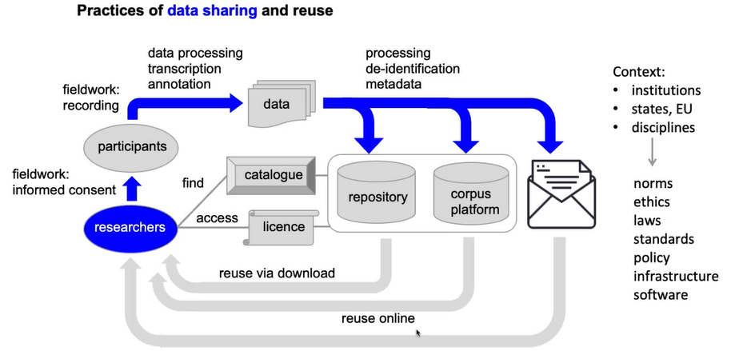
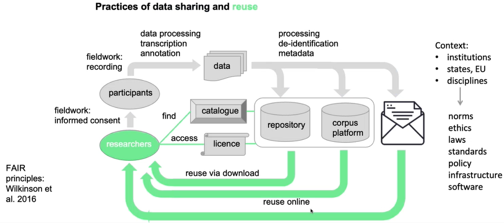

Dal punto di vista tecnico le infrastrutture digitali (sono quelle che si vedono nel mezzo) sono cruciali in questo processo.
Nella condivisione e nel riuso dei dati sono contemplati tre mezzi:
1. repositorio
2. piattaforma digitale per la consultazione online 
3. l'invio dei dati a qualcuno tramite e-mail, 

Un quarto mezzo potrebbe essere rappresentato dalle "data sessions", ovvero incontri faccia a faccia dove si lavora sui dati.

L'invio di dati tramite e-mail non assicura che i dati siano reperibili e accessibili a chi non li conosca già. Quindi si considera questa modalità non aderente ai principi FAIR, come invece sono le prime due, cioè il repositorio e la piattaforma digitale. Infatti, il catalogo e la regolazione degli accessi assicurano la reperibilità e l'accesso ai dati.

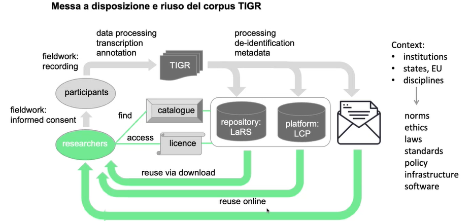

Nel caso del corpus TIGR verrà usato il repositorio LaRS, la sezione linguistica del repositorio SWISSUbase. 
Il repositorio LaRS è organizzato secondo tre livelli gerarchici:
1. Studi
2. Dataset (entità scaricabile)
3. Documenti

Ad ogni livello ci sono dei metadati, alcuni obbligatori e altri facoltativi, che l'utente del repositorio deve inserire.

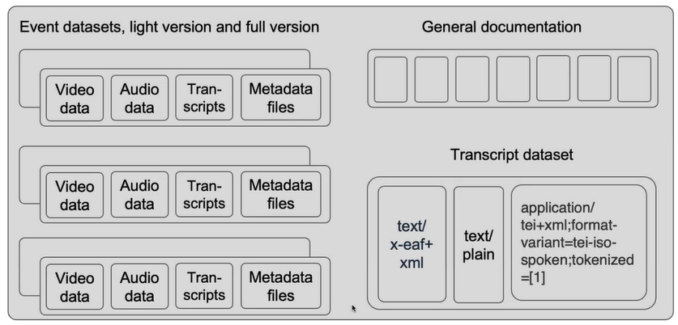

Nell'immagine sopra i dataset che verrano caricati.  
Ci sarà un dataset generale di documentazione che contiene la documentazione del corpus intero (documentazione metodologica, consensi informati, ecc.).  
Ci saranno poi i dataset dei singoli eventi. Di ogni evento ci sarà una versione leggera e una versione completa (che contiene le singole tracce audio). All'interno di ciascun dataset saranno raccolti dati video, dati audio, le trascrizioni e file di metadati.   
L'ultimo dataset sarà un dataset di sole trascrizioni, pensando a coloro che hanno la necessità di fare ricerca sulle trascrizioni e non hanno bisogno di visionare o di ascoltare i file multimediali. 

Il repositorio assegna un DOI a ciascun dataset.
Il dataset è l'unità scaricabile.

Post sul blog scientifico sulla trascrizione in ELAN:

- Contributo blog del 2 maggio 2024: [Morfologia delle trascrizioni, parte I: leggibili in che modo?](https://sharetigr.usi.ch/it/news/feeds/38046)  
- Contributo blog del 9 maggio 2004: [Morfologia delle trascrizioni, parte II: codificare il tempo](https://sharetigr.usi.ch/it/news/feeds/38066)  
  Video associato: https://www.youtube.com/watch?v=Ileqblg23_o   
- Contributo blog del 6 giugno 2004: [Morfologia delle trascrizioni, parte IV: allineamento temporale e segmentazione](https://sharetigr.usi.ch/it/news/feeds/38075)  
  Video associato: https://youtu.be/rUkGMdGEZbM  
- Contributo vlog del 13 giugno 2004: [Morfologia delle trascrizioni, parte V: gestire le sovrapposizioni](https://sharetigr.usi.ch/it/news/feeds/38294)  
  Video associato: https://youtu.be/1sTw4s-9f44

Riferimenti: 

- Brugman, H., Russel, A. (2004). Annotating Multimedia/ Multi-modal resources with ELAN. In: Proceedings of LREC 2004, Fourth International Conference on Language Resources and Evaluation.  
- Selting, M., Auer, P., Barth-Weingarten, D., Bergmann, J., Bergmann, P., Birkner, K., Couper-Kuhlen, E., Deppermann, A., Gilles, P., Günthner, S., Hartung, M., Kern, F., Mertzlufft, C., Meyer, C., Morek, M., Oberzaucher, F., Peters, J., Quasthoff, U., Schütte, W., & Uhmann, S. (2011). A system for transcribing talk-in-interaction: GAT 2 translated and adapted for English by Elizabeth Couper-Kuhlen and Dagmar Barth-Weingarten. Gesprächsforschung, 12, 1-51. http://www.gespraechsforschung-online.de/heft2011/heft2011.html

A proposito, invece, delle tecniche di de-identificazione si riporta il link al sito del corpus **De-identificazione**. 

[Pubblicazioni e presentazioni nelle quali sono stati usati i dati TIGR](https://sharetigr.usi.ch/it/st/publications)

(dall'abstract che ho trovato su sharepoint, che dovrebbe integrare l'introduzione)  
The TIGR corpus of spoken Italian includes 23.5 hours of video-recorded and transcribed discourse and was gathered by a team of linguists at USI Università della Svizzera italiana in the Swiss cantons Ticino and Grisons in 2021-2022. It is currently being prepared for being shared via the Swiss FAIR-compliant (cf. Wilkinson et al. 2016) LaRS repository.
We describe the corpus design and some changes it underwent during fieldwork; the interaction with the speakers, including their informed consent to participate in the study; the set-up of audio and video recordings; sociolinguistic characteristics of the participants; transcription conventions and techniques; workflows of transcript processing in view of qualitative analysis and annotation; de-identification measures; scenarios of data reuse; the organization of the data and metadata on LaRS; an open science approach to problem solving during the preparation of the data to be shared; future perspectives.
TIGR was collected within a research project conducted at USI and focused on epistemic aspects of talk (InfinIta, SNSF grant no. 192771). At the same time, it was designed to increase the diversity of available resources for spoken Italian (for an overview see Mauri et al. 2019). It includes 23.5h of video recordings documenting 23 face-to-face interactions. These vary as to genre and as to external criteria (Sinclair & Ball 1996), more specifically event-related parameters (Deppermann/Hartung 2011:423-424) such as institutionality, the number of participants, speaker roles and the presence of multi-activity (Mondada 2009): table conversations (6h5'), food preparation (1h40'), tutoring encounters (4h40'), lessons and practical instruction (7h20'), interviews (3h40'). The data collection process underwent some changes due to the Covid-19 pandemic, which had an impact on the corpus structure. The 115 speakers are 10-70 years old (most represented range: 20-29 years) and about 3/4 of them finished a higher secondary school. They declared their consent to data use and re-use for scientific purposes and expressed some de-identification demands. The technical set-up included two camcorders and 2-4 pocket audio recorders equipped with clip-on microphones, all synchronized through timecode generators. The A/V files were aligned and cut to equal length in Adobe Premiere. The team then transcribed them in ELAN (Sloetjes/Seibert 2016) using an adapted version of the GAT 2 conventions (Selting et al. 2011). A transcription technique was adopted that privileged the alignment of segment boundaries with boundaries of overlapping speech, such as to facilitate the revision of transcripts in ELAN and the manual layout of complex sequences with overlapping speech. Proper names were pseudonymized.  
The data will be made available on the SWISSUbase repository using the metadata scheme provided by LaRS, which is tailored for data in linguistics. The data will be downloadable upon signing a user agreement with the corpus owners. To enhance interoperability and reusability, we plan to provide two transcript versions in addition to the EAF file generated by ELAN. By now, we have implemented a script-assisted workflow to produce TXT transcripts that are optimized for the human eye and preserve a reduced amount of timecode stamps. Later we intend to create tokenized transcripts readable by corpus linguistic software. In A/V files we are masking faces and voices, where so required, and replacing proper names by noise. For each recorded event, we are editing a single compact, easy-to-use movie file with split screen and mixed audio. Once ready, the corpus will be uploaded to the repository, completed by metadata and documentation. Users could have the following download options: event by event, either a full version (A/V files, compact movie, EAF file, transcripts) or a light version (compact movie, transcripts); transcripts only for all events at once, raw TXT or tokenized.  
While preparing the data, we are step by step building a webpage to present the corpus. In parallel, we use a lab blog (sharetigr.usi.ch) to publicly report on our experience and discuss issues we are facing, thus building a case study of open research data practices in linguistics. 
A desirable further step is to make the corpus accessible on a platform that allows for on-line viewing and query. Currently, no such platform is available in Switzerland. USI has started a collaboration with LiRI (Linguistic Research Infrastructure, University of Zurich) to explore possible software developments.

(Da Linkedin)
Lo scorso mese è iniziato il progetto ShareTIGR , il cui obiettivo è di condividere con la comunità scientifica il corpus TIGR, un insieme di materiali per lo studio dell'italiano parlato raccolto nei cantoni svizzeri Ticino e Grigioni. Il presente contributo presenta in breve il progetto e inaugura una serie di blog post che racconteranno le attività del team in carico.

Il corpus TIGR documenta interazioni che si sono svolte faccia a faccia negli anni 2021-2022 - in periodo pandemico, dunque! - in situazioni di vario genere: conversazioni a tavola, preparazione di cibo, incontri di tutoring in architettura, lezioni, interviste. Le interazioni sono state registrate con due telecamere e microfoni da bavero e in seguito trascritte mediante un'applicazione (ELAN ) che associa ogni pezzo di testo al/la parlante che l'ha prodotto e all'intervallo corrispondente del file video. I materiali sono stati raccolti nel quadro di una ricerca finanziata dal Fondo Nazionale Svizzero (il progetto InfinIta sulle fonti d'informazione nell'italiano parlato, 2020-2024), ma sono ricchi di informazioni utili a indagare una vasta gamma di temi oltre quelli previsti dal progetto d'origine. I corpora orali possono infatti essere usati per studiare in diverse prospettive l'interazione, il discorso, il lessico, la grammatica, la variazione geografica e sociale della lingua.

Condizione del riuso dei dati è che essi siano reperibili, accessibili tecnicamente e disponibili in formati di ampia diffusione e interoperabili, in breve che siano FAIR (findable, accessible, interoperable, reusable, Wilkinson et al. 2016). I dati del TIGR sono stati raccolti in tal modo da poter soddisfare questi criteri e contemporaneamente assicurare un'adeguata protezione dei dati personali (sul difficile bilanciamento delle varie esigenze si vedano Diaz 2022 e Miecznikowski e Profazi 2023b). Nello specifico, ogni partecipante registrata/o ha espresso il proprio consenso all'uso dei dati dopo essere messa/o a conoscenza degli scopi dell'indagine e delle modalità di diffusione dei dati. In ShareTIGR, elaboreremo ulteriormente i dati, eliminando certe informazioni personali, preparando file audio-video maneggevoli, convertendo e formattando le trascrizioni, redigendo descrizioni a vari livelli e preparando metadati leggibili dai motori di ricerca. Infine, li depositeremo su SWISSUbase , un repositorio scientifico svizzero per le scienze sociali e la linguistica. Gli utenti interessati potranno così scaricare i documenti e usarli ai fini delle proprie ricerche, dopo essersi registrati e aver firmato un accordo che precisa le modalità e gli scopi del riuso.

Dopo il deposito su repositorio, un ulteriore scenario di condivisione può essere quello di inserire i documenti su una piattaforma che permetta la loro consultazione e analisi online. Piattaforme esistenti per i corpora orali come il sito del corpus KiParla (Mauri e Goria 2018, Miecznikowski e Profazi 2023a), la Datenbank für Gesprochenes Deutsch DGD (Schmidt 2014) o il Corpus de LAngue Parlée en Interaction CLAPI  mostrano i vantaggi e il potenziale della consultazione online. Ciò è emerso chiaramente da una serie di giornate di studio organizzate nel quadro di un progetto attualmente in corso all'USI, in collaborazione con altre università svizzere, co-finanziato da swissuniversities e volto a esplorare "Data-sharing skills in corpus-based research on talk-in-interaction" (CHORD-talk-in-interaction ). Piattaforme per corpora orali multimediali devono tuttavia ancora essere sviluppate in Svizzera.

Tornando a ShareTIGR, il progetto durerà un anno e sarà coinvolto il team di InfinIta (Johanna Mieczikowski, Elena Battaglia e Christian Geddo ), che è stato presente sul campo e ha rivisto le trascrizioni, rafforzato nei primi mesi dal contributo di una collaboratrice attiva anche in CHORD-talk-in-interaction ( Nina Profazi ). Durante quest'anno, in parallelo al lavoro sui dati completeremo man mano la descrizione del corpus TIGR sul sito del progetto e condivideremo la nostra esperienza tramite il blog, a più voci e in due lingue (italiano e inglese). Ci rivolgiamo a studiose e studiosi di linguistica e delle scienze sociali, a persone interessate alle digital humanities, a specialisti della gestione di dati, a divulgatori scientifici e al pubblico interessato. Usando diversi canali, dai convegni scientifici alle pagine web, il blog e i social media, intendiamo trattare la preparazione del corpus TIGR come un caso studio che permetta di riflettere su sfide e opportunità, problemi e soluzioni che riguardano più generalmente gli open research data (ORD ) in linguistica e in campi affini.
