# KEYWORDS
- Progetti Collaborativi, Condivisione, Editor di Testo, Versioning, Formato Markdown, Github, Client Git, Visual Studio Code

# 3 STRUMENTI FONDAMENTALI PER PROGETTI COLLABORATIVI 
Un progetto collaborativo presuppone, innanzitutto, di poter condividere risorse (files). A tal fine esistono strumenti che consentono la condivisione in maniera efficiente e affidabile. 

Una soluzione possibile si basa su un repository centralizzato Gitbub il quale, oltre alla condivisione, fornisce tanti altri servizi fra cui il "versioning": è possibile cioè avere delle "fotografie" temporali del contenuto di un file. Queste "fotografie" consentono, come fossero dei backup, di riprendere, in qualunque momento, una versione specifica del file ad un istante temporale specifico. 

Per realizzare quanto sopra (e molto molto altro) occorre dotarsi di 3 strumenti:
1. un account su Github
2. un editor di testo evoluto/estendibile da installare sul nostro computer (es: Visual Studio Code)
3. un client Github da installare sul nostro computer

Al fine di arricchire i file di testo di elementi di stile/formattazione (titoli, sottotitoli, elenchi, tabelle, link) si utilizzerà il formato testuale denominato "markdown" (estensione tipica di file: .md).

Ultimo, ma non meno importante, giova sottolineare che l'architettura sopra descritta è "indifferente" al sistema operativo utilizzato nel senso che è realizzabile su tutti i principali sistemi operativi (Windows, Mac, Linux) ed è free, nessuno dei componenti citati richiede l'acquisto.

# CREAZIONE ACCOUNT GITHUB
- Andare sul sito https://github.com/ e creare un proprio **account github** ("Sign up for Github")

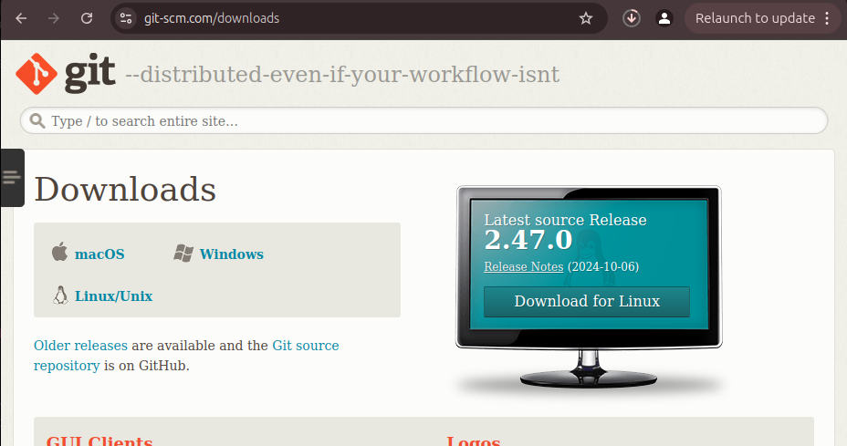

# INSTALLAZIONE EDITOR DI TESTO, VISUAL STUDIO CODE
- scaricare ed installare la versione di Visual Studio Code adatta al proprio sistema operativo da:
	- https://code.visualstudio.com/Download
- dopo aver scaricato il software effettuare l'usuale doppio-click col mouse sul file eseguibile (**Windows**) normalmente disponibile nella cartella **Download** 

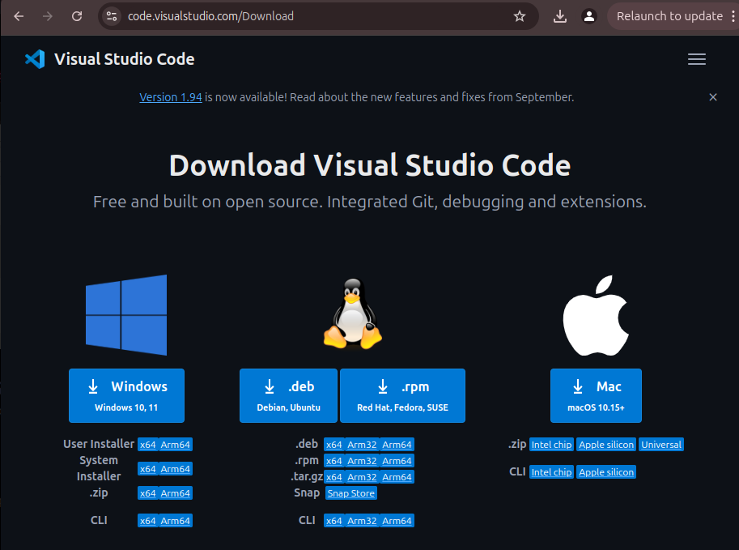
# INSTALLAZIONE CLIENT GIT
- scaricare ed installare la versione di **Git** adatta al proprio sistema operativo da:
	- https://git-scm.com/downloads
- - dopo aver scaricato il software effettuare l'usuale doppio-click col mouse sul file eseguibile (**Windows**) normalmente disponibile nella cartella **Download**

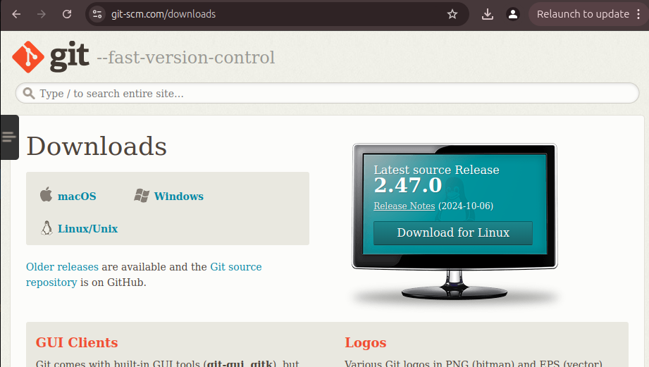

# CONNESSIONE DI VISUAL STUDIO CODE A GITHUB (viene fatta una sola volta poi resta attiva... fino a disconnessione esplicita)
- Vogliamo consentire a Visual Studio Code di interagire col repository Github, utilizzando le utility (comandi) che il pacchetto Client Git ci mette a disposizione.

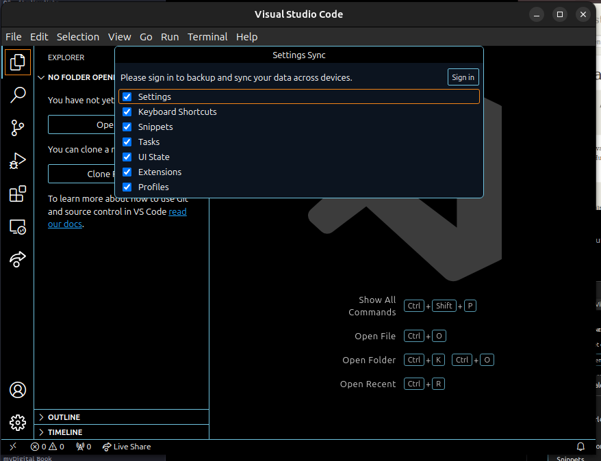

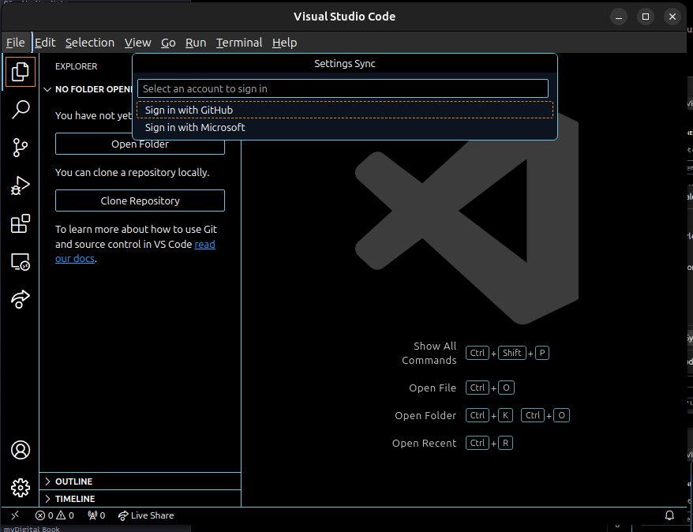
- Viene richiamata la pagina web di login del browser di default
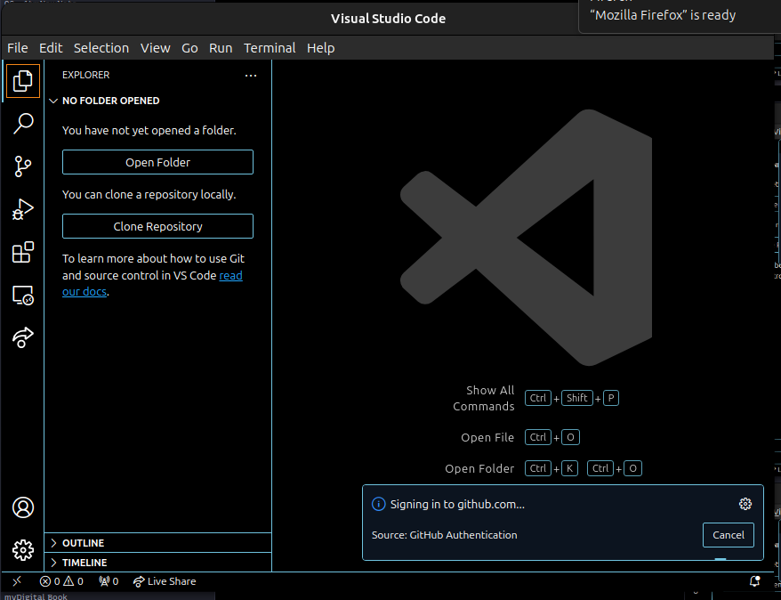

# VOGLIAMO ORA CLONARE LA CARTELLA PRESENTE SU GITHUB IN LOCALE
1. Accediamo al nostro github (dopo che abbiamo accettato l'invito via mail conseguente a qualcuno che ci condivide una cartella github!) e andiamo nella cartella condivisa (click sul pulsante CODE -verde- e copiamo la path HTTPS, che è il link alla specifica cartella "formazione-knowledge base"):

1. Da Visual Studio Code apriamo un terminale: menu Terminal > New Terminal 

1. Ora vogliamo clonare il repository github, che non è una semplice cartella poiché contiene una serie di elementi che consentono poi di ereditare tutte le funzionalità proprie di github (fra cui il versioning!!):
   Nel terminale apriamo un **githbash (o bash)** che ora disponibile in VSC grazie all'installazione del componente **Git Client**.
   - sceliamo gitbash o bash:
  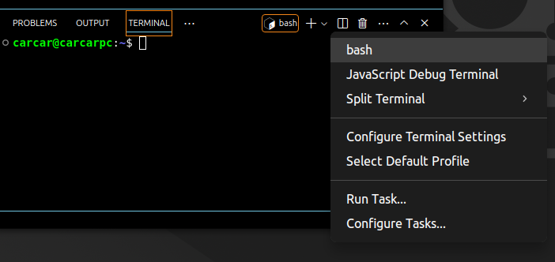
- ora è visibile bash (a fianco della tendina):
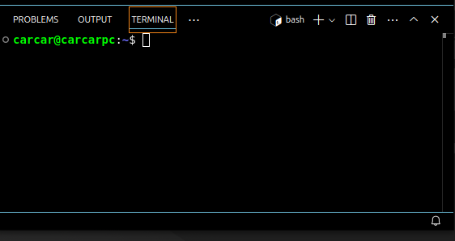
- digitiamo il comando **git clone** + spazio poi la path https:
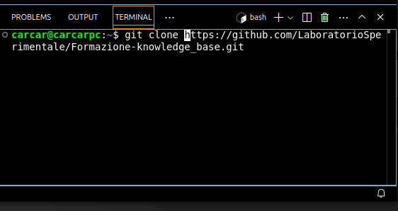
- quindi ci viene richiesto di attivare il processo di **sign in usando GitHub**
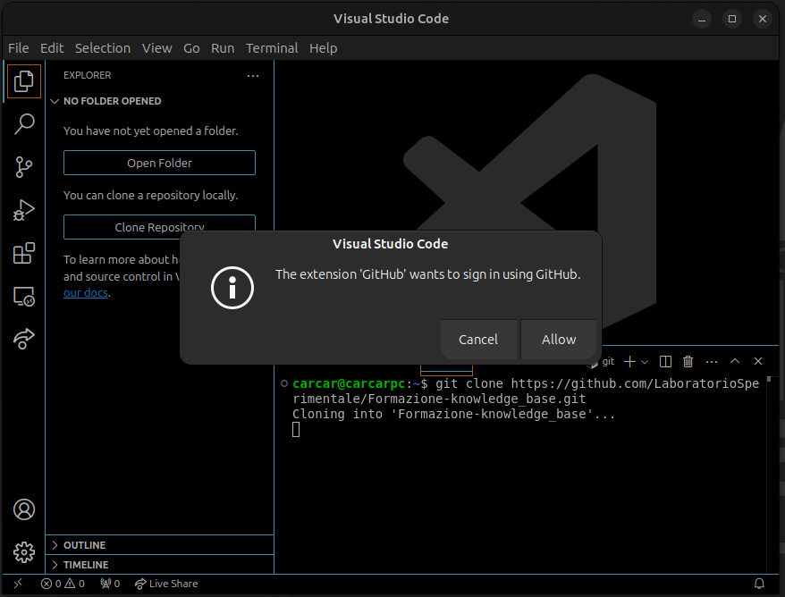

- procediamo; quando diamo "allow" il processo di sign in resta in attesa in VSC che sia fatto sul browser di default (che viene aperto). Se siamo già loggati la procedura di cloning si avvierà... altrimenti procediamo alla login:
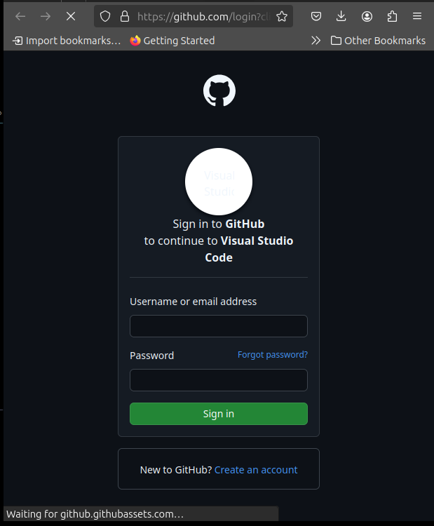

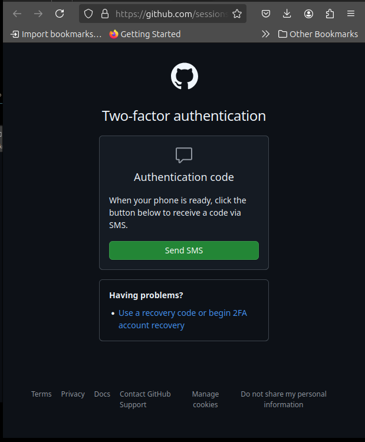

- Al termine il browser ci chiede autorizzazione ad aprire l'app che deve eseguire il cloning... clicchiamo open:

- la procedura di cloning si conclude nel terminale aperto in VSC:
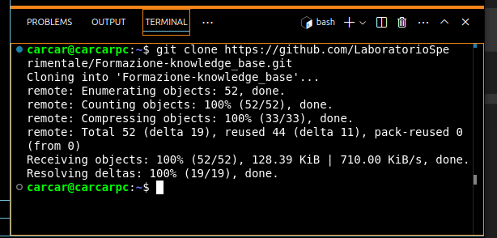
- notiamo, alla terza riga:
	- **Cloning into *'Formazione-knowledge_base'***

# APERTURA E VISUALIZZAZIONE DELLA CARTELLA GITHUB CLONATA (ORA DISPONIBILE IN LOCALE)
 - per aprire il clone locale la dobbiamo trovare entro il nostro file system
- nel terminale digitiamo: **pwd**. Questo comando da come risposta dove ci troviamo 
- nel mio caso mi restituisce la mia home: /home/car 

- torniamo a VSC e apriamola: menù File > Open Folder e identifichiamo la cartella nell'esplora risorse che viene aperto.
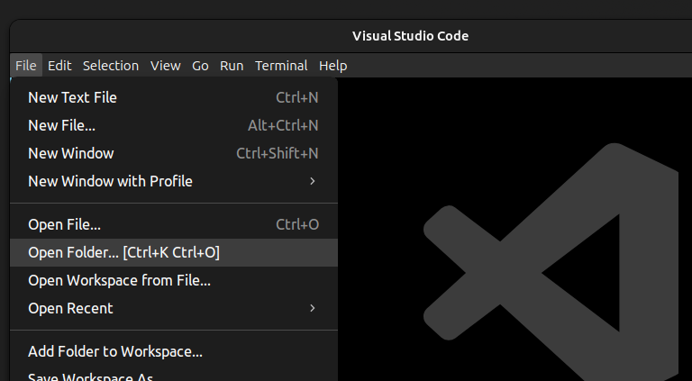
- facciamo open (nell'immagine in alto a destra):

- ultimo step... di sicurezza: conosciamo chi è che ha creato la cartella e possiamo fidarci dell'autore (nota che durante il cloning TUTTO quello che è nel repository viene copiato in locale... occorre sapere chi è che ha condiviso cosa!!!)
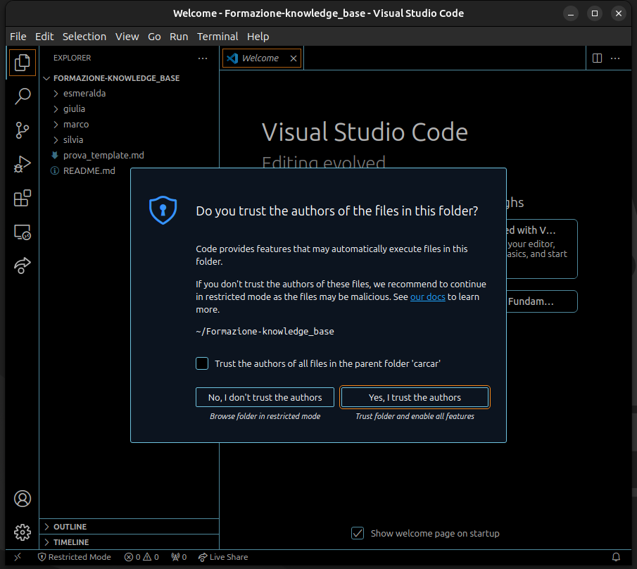

# CREAZIONE DI FILE IN LOCALE E COPIA (UPLOAD) NEL REPOSITORY COMUNE (GITHUB)

- procedo creando una cartella denominata Carmelo e ci creo all'interno un file prova.md:
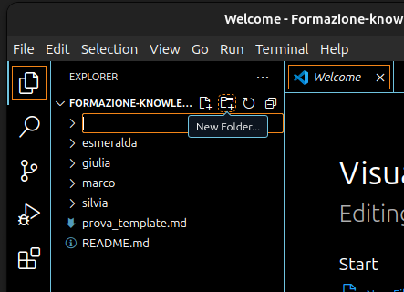
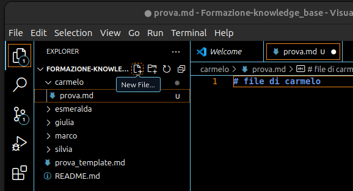
- passo a **SOURCE CONTROL** (nota che già appare "1", cioè c'è una modifica che può/richiede di essere committata):
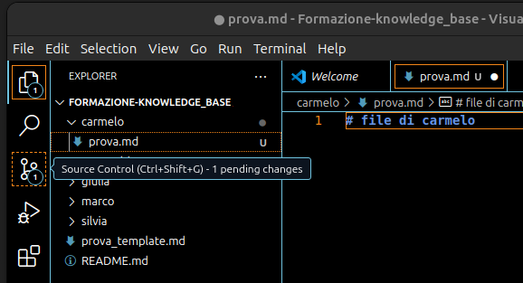
- quello che può essere committato appare anche ora (nel source control);
**- prima devo passare i files a "staged" (cioè, nella lista dei file modificati devo cliccare il simbolo +)**
**- poi posso procedere con la commit e il push**

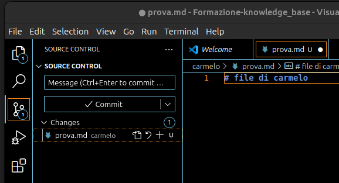
- prima di eseguire il commit assegno un nome e premo invio:
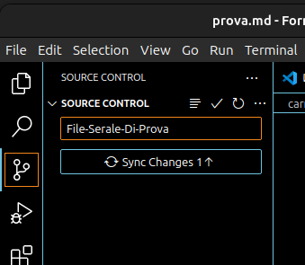
- 
- se ottengo una richiesta posso anche ottemperare, altrimenti procedo otre(vedi:https://git-scm.com/book/en/v2/Getting-Started-First-Time-Git-Setup):
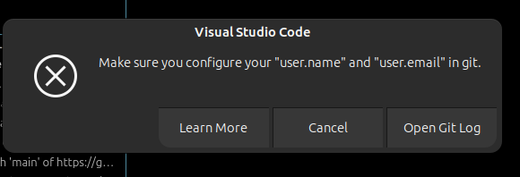

- Ora il file è entrato nel repository (da questo momento il file eredita tutte le funzionalità proprie di github, fra qui il source control)... ma è presente solo in locale... gli altri utenti non lo vedono. Procedo col **Sync Changes** 

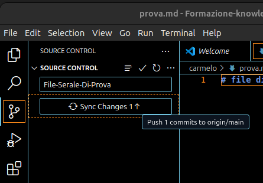

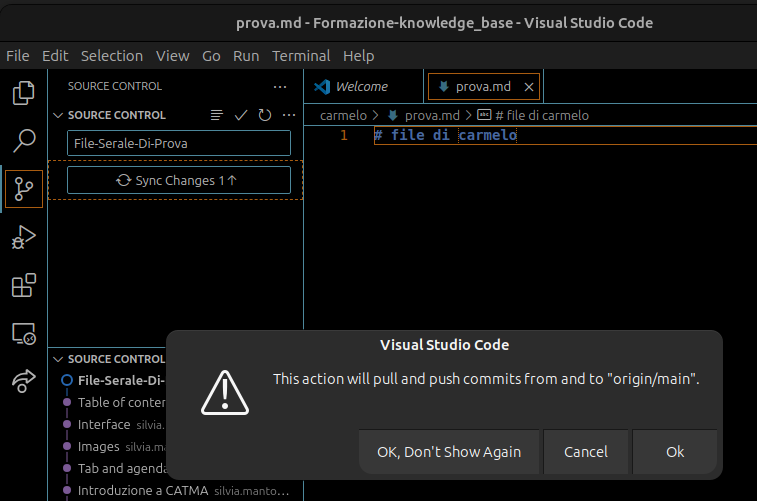

# COME APPARE ORA IL REPOSITORY
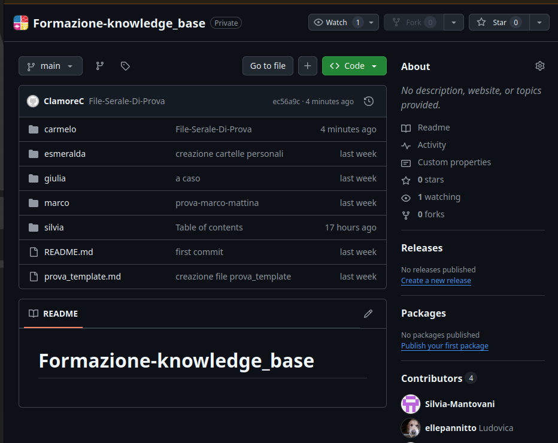

